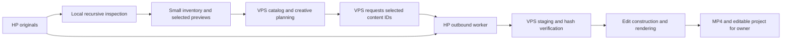

# Owner media, editing, and Kdenlive

Assessment and implementation boundary, updated 2026-09-22.

The owner library is now cataloged on the VPS (175 files, 168 unique content
IDs) and its declared provenance is recorded. The first private production,
`dreamdrip-private-test-001`, has received selected source bytes and produced
an editable project plus a 148-second review MP4. The VPS still cannot read
`~/Videos/dreamdrip/assets/` directly. Rights for the selected YouTube Audio
Library track remain individually unverified, so this artifact must stay out
of publication until its track record is confirmed.

## Source access and ownership

The owner identified the originals as `~/Videos/dreamdrip/assets/` on a local
Linux HP, recursively including its subfolders. That path is **not on the
VPS**. The uploaded inventory establishes technical sufficiency and content
counts; source bytes are still HP-only until a selected transfer completes.
Inspection of accessible VPS locations found project outputs, test fixtures,
QA captures, and application images, not an identifiable owner download
library. `/mnt` and `/media` were empty; `/root/Downloads` was absent.

The source library remains on the HP. Its files are owner data and must be
backed up independently of the replaceable GPU worker runtime. Never treat
these originals as disposable worker scratch data. Scanning reads them;
imports do not rename, move, delete, transcode, or write them.

## What works now

| Concern | Evidence / current behavior | Remaining gap |
|---|---|---|
| Discovery | `scripts/media.py`: explicit recursive folder scan, no directory-symlink traversal | No authenticated HP scan invocation yet |
| Catalog | SHA-256 identity, host-bound locations, deduplicated records, atomic JSON updates under `flock` | No inventory synchronization service |
| Compatibility | ffprobe streams, dimensions, codecs, rates, color metadata, rotation side data, duration; full FFmpeg decode with a one-hour per-file timeout | No automatic normalization; decode success is not Kdenlive effect compatibility |
| Bad inputs | Corrupt, unsupported, timed-out, missing, and changed sources reported; identities remain available for diagnosis | Files over the decode timeout need a deliberate inspection strategy |
| Meaning | Explicit descriptions/tags/provenance; annotation search; unknown by default | No automatic content understanding, beat detection, or shot segmentation |
| Mixed origins | Owner and generated assets share the same catalog; each keeps its own origin/evidence | Generation stages do not yet register results automatically |
| Existing-media handoff | Request-scoped source/preview bundles are hash- and decode-verified; `import-media` creates an ordinary still-image/audio project by reference | Arbitrary footage source ranges are not yet selected by the planner |
| Timeline / timing | Existing per-scene render spec plus native Kdenlive frame-timed clips; crossfade overlaps become two video tracks | No semantic shot selection or rational-rate video source range planner yet |
| Motion / transitions | FFmpeg path supports zoom/pan/static; Kdenlive path supports editable affine pan/zoom, brightness fades and alternating-track crossfades | Arbitrary footage transitions still need their own parity tests |
| Audio | Existing `audio.py` layers, start offsets, fades, gains, ducking, loudness mastering and loop crossfades | The importer uses one existing soundtrack; no automatic music/narration alignment or exported editable stems |
| Render / recovery | Existing FFmpeg H.264/AAC, QC, thumbnails and publication package; imports commit metadata last and retry safely before that | Existing rendering writes its output directly; no checkpointed long-form edit render |
| Gate / provenance | Selected source hashes and rights rechecked by validation/review; source snapshots and attribution obligations included in package; no automatic quality grade | Rights records are supplied evidence, not automated verification of license terms |
| Presentation | Ordinary MP4, editable project, selected-media archive, provenance manifest and QC evidence | Web download/relink UX remains next work |
| Portability | Kdenlive project sources are project-relative; used media is hardlinked when possible and packaged with hashes/provenance | A relocation/reopen fixture remains a regression test to add |

The bootstrap is an explicit still-image edit. It does not inspect descriptions
and invent creative decisions. Use `run`, which assembles existing inputs;
`produce` still orchestrates generation and is not the bootstrap command.

## Local catalog workflow

Run the scanner **on the HP**, from a checkout containing this change. It needs
Python 3, ffmpeg and ffprobe; it uses no Python package dependencies or paid
services. The catalog belongs outside the originals:

```bash
python3 scripts/media.py --catalog "$HOME/.local/share/content-machine/dreamdrip-catalog.json" \
  scan "$HOME/Videos/dreamdrip/assets"
python3 scripts/media.py --catalog "$HOME/.local/share/content-machine/dreamdrip-catalog.json" list
```

Scan emits a JSON report and returns 1 if files were refused (including
unsupported sidecars); successfully inspected records are still saved.
Interrupted scans preserve the last completed record. Rescanning rechecks
media and retains annotations for identical bytes. It may read large files
twice for hashing and decoding, but creates no media copies. `check` rehashes
known local locations and reports which identities are currently available.

The initial catalog intentionally leaves subject descriptions, source origin,
and rights unknown. Inspect actual frames / listen to audio before annotating.
Do not infer content or rights from names such as "royalty-free".

```bash
./content-machine media annotate FULL_SHA256 \
  --description 'Description based on inspecting the actual media' \
  --tag forest --tag calm --origin owner \
  --source 'Original download page or other source record' \
  --rights /path/to/rights.json
./content-machine media list --kind video --query 'forest calm'
```

Use `--catalog PATH` immediately after `media` when using a nondefault catalog.
The default is `library/catalog.json`, gitignored. Annotations are explicit
updates to the catalog; they never modify source files. `--rights` is optional
for annotation, so classification does not wait for licensing research.

An actual rights record needs the source/creator or provider, the applicable
license or permission, whether the intended commercial use is allowed, any
attribution obligation and its text, and evidence. Useful evidence is the
source page plus saved license text, a receipt/subscription entitlement tied
to the download, or permission from the rights holder. For owner-created
media, record authorship and any third-party material contained in it. The
owner has not supplied this information yet. The scanner makes no rights
claim; `import-media` refuses missing or nonpermissive declarations. See
`config/media-rights.example.json` for a deliberately **uncleared** template.

## Getting selected media to the VPS

Recommended architecture:



The VPS owns selection, job state and production status. The HP advertises
asset availability and performs outbound transfers; the VPS never opens an
inbound connection to the HP or exposes ComfyUI. If required bytes are only on
an offline HP, the production waits for source availability without consuming
a render attempt. Once selected originals are staged on the VPS, rendering
can continue with the HP off. A later capable local editing worker can instead
render against its existing originals and upload the resulting artifacts.

Implement a separate media-ingestion capability/job payload when extending
the worker: the existing generation request digest describes a different kind
of work. Reuse the lease, identity, TLS, staging-manifest and receiving-side
hash-verification rules; do not disguise owner media as ComfyUI output. Scope
requests to declared source roots and known content IDs. Transfer only selected
content; deduplicate shared VPS media by hash and reference it across projects.
An interrupted upload must remain in staging, with size/hash checks before
atomic promotion. Never propagate deletions back to the original library.

**Implemented transfer boundary:** the VPS writes a content-ID request and the
HP exports either a source bundle or inspection bundle. The receiving VPS
validates the request, archive paths, member count, hashes, stream kind and a
full decode before atomically publishing bytes under `library/objects/` or
`library/previews/`. It never writes the HP originals. The transport itself is
still deliberately an existing authenticated outbound channel (usually `scp`
over SSH, or the owner's established worker transport):

```bash
./content-machine media merge /path/to/received/dreamdrip-catalog.json
./content-machine media list --query 'forest'
./content-machine media check
```

`check` correctly reports HP-only assets as unavailable locally. For a selected
request created on the VPS, run the following on the HP checkout that contains
the current `scripts/media.py` and the uploaded catalog:

```bash
python3 scripts/media.py --catalog "$HOME/.local/share/content-machine/dreamdrip-catalog.json" \
  export /path/to/dreamdrip-private-test-001.json \
  --output "$HOME/.local/share/content-machine/dreamdrip-private-test-001.tar.gz"
```

Copy only that bundle to the VPS incoming directory through the owner's
authenticated channel, then run on the VPS:

```bash
./content-machine media receive library/incoming/dreamdrip-private-test-001.tar.gz \
  --request library/requests/dreamdrip-private-test-001.json
```

Use `mode: preview` for small derivatives during content inspection and
`mode: source` for the private edit. The receipt contains receiving-side
ffprobe/full-decode evidence and any embedded PNG metadata. A transfer with
different bytes gets a different identity and cannot substitute for the
selected ID. `merge` preserves existing annotations and fills unannotated
records; it does not overwrite locally recorded rights. Changed rights
require an explicit annotation update.

The remaining external boundary is the authenticated HP-to-VPS copy of the
selected request. A whole-library mount or copy is unnecessary.

## Runnable still-image bootstrap

Once selected originals are locally accessible (images declared owner-created;
audio can remain explicitly unverified for a private review only):

```bash
./content-machine import-media dreamdrip-bootstrap-001 \
  --image-id FIRST_IMAGE_SHA256 --image-id SECOND_IMAGE_SHA256 \
  --audio-id AUDIO_SHA256 \
  --title 'Chosen production title' --description 'Production description' \
  --motion zoom_in --transition-seconds 2 --allow-unverified-audio
./content-machine run dreamdrip-bootstrap-001
./content-machine kdenlive dreamdrip-bootstrap-001
```

The duration defaults to the soundtrack. `--duration` can trim it; a duration
longer than the audio is refused so narration is not accidentally looped.
Use the existing audio composition stage to author deliberate long ambience
loops first. Image count and duration must leave enough frames for transition
handles. The current renderer's 24-scene limit still applies because it opens
all scene inputs at once on the 3.8 GB VPS.

The private flag writes an uncleared audio manifest and keeps the publication
gate blocked; omit it once a track-level rights record is available. The
commands write `video_spec.json`, source snapshots in `metadata.json`,
and an audio rights manifest. Originals remain referenced by absolute path;
there are no source links/copies inside the project. Moving an original blocks
the project until its reference is deliberately repaired. Rescanning a moved
file recovers its catalog identity but intentionally does not rewrite an
existing edit. A new import needs a new project ID and cannot overwrite an
existing project. `run` produces the usual MP4/QC/package; human grade/review
requirements remain in force, so a technically successful render may correctly
remain `NEEDS_ATTENTION`.

## Kdenlive integration and current adapter

Content Machine uses a **version-tested native Kdenlive XML exporter plus
headless MLT rendering**. `scripts/kdenlive.py` writes generation-5/version-1.1
projects with producers, editable source references, SHA-256 producer
properties, playlists, tractors, an audio track, editable gain/fade filters,
affine motion and alternating video tracks for crossfades. It preflights
source hashes and required MLT plugins, renders with MLT, and writes a review
MP4 beside `output/ID.kdenlive`. It also emits a project-relative selected-media
archive and provenance manifest.

Kdenlive explicitly documents that project XML records source references,
timing and effects, and that MLT can render these files. The current documented
format includes sequences introduced in 23.04, with document version 1.1;
older applications cannot necessarily read newer projects. Pin and record the
owner's actual Kdenlive/MLT versions before choosing the fixture format.
[Kdenlive project format](https://docs.kdenlive.org/en/project_and_asset_management/file_management/project_files.html)

Its developer description specifies producers, two playlists per timeline
track, track tractors, sequence tractors, the `main_bin` playlist and the final
project tractor. It also records the per-clip IDs and source/proxy properties.
The adapter was verified against the installed Kdenlive 23.08.5 / MLT 7.22.0
fixture, including Kdenlive 23.08.5 loading the native sequence, its two-track
lanes, nine image clips, audio clip and 3,552-frame timeline, then rendering
H.264/AAC through MLT. A generic `.mlt` playlist renamed `.kdenlive` is not
sufficient evidence that a timeline is editable.
[Kdenlive developer format](https://raw.githubusercontent.com/KDE/kdenlive/master/dev-docs/fileformat.md)

Kdenlive also supports OpenTimelineIO import/export for tracks, clips and
markers. The documented scope does not establish complete effect, audio-mix
or render-profile preservation. Keep OTIO as a possible interchange format;
do not select it as the sole production authority without parity tests.
[Kdenlive OTIO documentation](https://docs.kdenlive.org/en/user_interface/menu/file_menu.html)

MLT's XML model supports explicit producer references, playlist source ranges,
tracks, filters and transitions. Source in/out points are inclusive frames;
convert from a normalized start-plus-duration representation only at the
adapter boundary to avoid off-by-one edits. Use rational frame rates and exact
integer timeline positions in the new backend.
[MLT XML](https://www.mltframework.org/docs/mltxml/)

Use an explicit avformat consumer to render the chosen sequence to a temporary
output. The `melt` command exposes consumer selection; Kdenlive's render dialog
can also generate batch scripts. Launching the editor or playing an XML file
does not prove an encoded artifact exists. Render with the same MLT/plugin
versions used for fixture verification; avoid a GPU/OpenGL requirement for the
VPS path.
[MLT command line](https://www.mltframework.org/docs/melt/),
[Kdenlive rendering](https://docs.kdenlive.org/en/exporting/render.html)

The upstream application source inspected for this assessment also exposes
`--verify-file` (headless load plus document consistency checks), `--render`,
`--render-preset`, and `--setup-report`. This supplies a stronger verification
route than checking XML syntax. Probe the installed binary's `--help` before
using these flags: upstream source is not proof that the owner's installed
release contains them. Where available, prefer Kdenlive's own headless load
and render as the native-project acceptance check; retain direct MLT rendering
as the controlled backend, with parity tests. There is no need for GUI click
automation to start such jobs.
[Kdenlive application command-line source](https://raw.githubusercontent.com/KDE/kdenlive/master/src/main.cpp)

## Edit representation and creative decisions

Keep editorial reasoning in `metadata.json` (creative/research references,
selected asset IDs, scene purposes, motifs, intensity, pacing and decisions).
Keep `video_spec.json` as the minimal technical renderer contract. Extend its
technical representation only when the native backend can execute it: source
IDs, source ranges, timeline placements, transition handles, motion keyframes,
audio placements/gains/fades and target profile. A resolved MLT graph is a
derived rendering artifact, not a competing source of editorial truth.

The planner should consume a compact creative direction and observed asset
descriptions, with confidence/evidence, rather than filename guesses. For each
beat it chooses a matching asset, range, duration, motion and transition,
records the reason and validates feasibility. Scarce assets, uncertain content
and unsupported effects are visible planning constraints. A Dreamdrip profile
may specify slow holds, restrained dissolves, recurring motifs, gradual
intensity changes and a quiet ending. These are project/profile choices, not
global behavior for every Content Machine concept.

Before export, prove: source ranges exist; clips cover the intended duration;
overlaps have handles; no unwanted gaps occur; frame rounding is consistent;
narration is neither truncated nor repeated; intended music/ambience loops have
seam treatments; SFX timings and levels are deliberate; and the final ending
has enough visual/audio release. Do not shorten the target accidentally by
subtracting transitions twice.

Preserve original footage producers and separate narration/music/ambience/SFX
tracks in the Kdenlive bin and timeline. Retain generated audio stems when an
editable export requires them; `audio.compose()` currently disposes of its
temporary layers. Map supported gain/fade/ducking decisions to native effects.
For processing that cannot round-trip, bake only the necessary derivative stem
and record its original source, recipe and hash. Do not flatten the whole film
to one clip and describe it as an editable assembly.

## Recovery, portability and delivery requirements

The future edit job identity must bind the chosen source hashes, edit plan,
renderer/adapter version and render settings. Build a new project revision
atomically under the existing project lock. Do not overwrite manual owner
changes: regeneration creates a new revision unless explicitly rebasing them.

Preflight every source and required plugin. A missing file waits for transfer
or yields an actionable error; it must not render a black placeholder. Render
to a temporary artifact, then check duration, streams, QC and soundtrack
measurements before promotion. Retrying a failed render reuses verified inputs;
it never damages a previous finished artifact.

Resolve content IDs to paths for each host. An HP editing copy can relink to
its originals without duplicating them. A portable bundle includes only the
used media/stems, project-relative references and a hash/provenance manifest.
Kdenlive's archive facility is evidence that media gathering is a separate
operation from saving a project. The pipeline now writes its own selected-media
package; archive contents and hash/provenance manifest are checked before it
is presented as portable.
[Kdenlive archiving](https://docs.kdenlive.org/en/project_and_asset_management/file_management/archiving.html)

Present the MP4, editable project/revision, source availability, used-media
manifest, attribution requirements, technical QC and outstanding human review
decisions together. A manual relink dialog is useful recovery in the editor,
but cannot be a normal unattended production dependency.

## Remaining acceptance work

The private still-image milestone is complete. Add regression fixtures for
relocation, missing/corrupt media and preservation of a manually changed owner
project before claiming unattended editing is robust for arbitrary projects.
Add footage ranges, multiple editable audio stems, beat-aware timing and
native mix/ducking decisions as those production inputs become available.
Existing assets can bypass generation; they do not bypass editing quality,
provenance, source access, or the review boundary.
